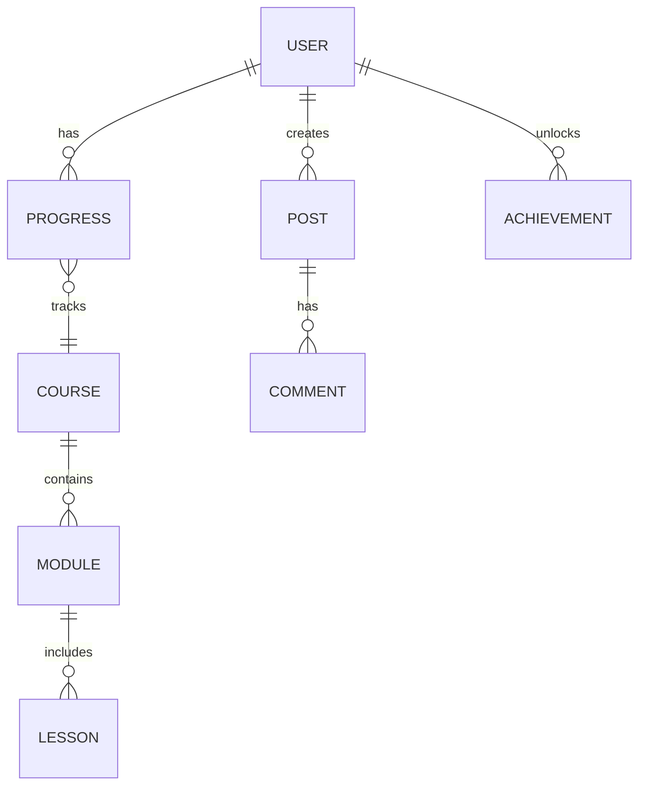

## 1. Architecture Design
```mermaid
graph TD
    Frontend[React Frontend] --&gt; Backend[Express Backend]
    Backend --&gt; Database[Local JSON Storage]
    Frontend --&gt; BrowserStorage[LocalStorage]
```

## 2. Technology Description
- Frontend: React@18 + TypeScript + tailwindcss@3 + Vite
- Initialization Tool: vite-init
- Backend: Express@4 + TypeScript
- Database: Local JSON storage (演示用，可扩展到Supabase)

## 3. Route Definitions
| Route | Purpose |
|-------|---------|
| / | 首页 |
| /courses | 课程中心 |
| /learn/vocabulary | 单词记忆 |
| /learn/grammar | 语法练习 |
| /learn/speaking | 口语跟读 |
| /learn/listening | 听力训练 |
| /learn/reading | 短文跟读 |
| /learn/writing | 写作练习 |
| /progress | 学习进度 |
| /community | 社区 |
| /profile | 个人中心 |
| /login | 登录 |
| /register | 注册 |

## 4. API Definitions
```typescript
// 用户相关
interface User {
  id: string;
  username: string;
  email: string;
  level: 'beginner' | 'intermediate' | 'advanced';
  avatar?: string;
}

// 课程相关
interface Course {
  id: string;
  name: string;
  level: 'KET' | 'PET' | 'FCE' | 'CAE' | 'CPE';
  description: string;
  modules: Module[];
}

interface Module {
  id: string;
  name: string;
  lessons: Lesson[];
}

interface Lesson {
  id: string;
  title: string;
  type: 'vocabulary' | 'grammar' | 'speaking' | 'listening' | 'reading' | 'writing';
  completed: boolean;
}

// 短文跟读
interface Passage {
  id: string;
  title: string;
  content: string;
  difficulty: 'easy' | 'medium' | 'hard';
  audioUrl?: string;
}

// 写作练习
interface WritingPrompt {
  id: string;
  title: string;
  description: string;
  difficulty: 'easy' | 'medium' | 'hard';
  wordCount: number;
  sampleAnswer?: string;
}

// 学习进度
interface Progress {
  userId: string;
  courseId: string;
  completedLessons: string[];
  totalTime: number;
  streak: number;
}

// 成就
interface Achievement {
  id: string;
  name: string;
  description: string;
  icon: string;
  unlocked: boolean;
}

// 社区动态
interface Post {
  id: string;
  userId: string;
  username: string;
  content: string;
  likes: number;
  comments: Comment[];
  createdAt: string;
}

interface Comment {
  id: string;
  userId: string;
  username: string;
  content: string;
  createdAt: string;
}
```

## 5. Server Architecture Diagram (if backend exists)
```mermaid
graph LR
    Controller[API Controllers] --&gt; Service[Business Services]
    Service --&gt; Repository[Data Repository]
    Repository --&gt; Storage[JSON File Storage]
```

## 6. Data Model
### 6.1 Data Model Definition


### 6.2 Data Definition Language
由于使用本地JSON存储，以下是数据结构定义（JSON格式）：
```json
{
  "users": [
    {
      "id": "1",
      "username": "demo",
      "email": "demo@example.com",
      "password": "demo123",
      "level": "intermediate",
      "avatar": null,
      "createdAt": "2024-01-01T00:00:00Z"
    }
  ],
  "courses": [
    {
      "id": "ket",
      "name": "KET 入门课程",
      "level": "KET",
      "description": "适合英语初学者，掌握基础词汇和语法",
      "modules": []
    }
  ],
  "progress": [],
  "achievements": [],
  "posts": []
}
```
